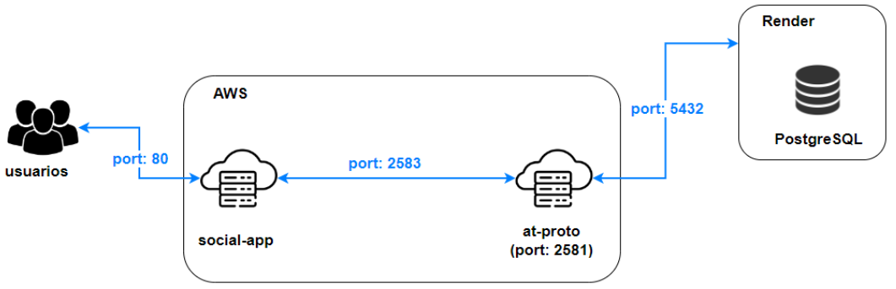

# Proyecto de Infraestructura como Código (IaC) con Terraform y AWS



Este proyecto emplea [Terraform](https://developer.hashicorp.com/terraform/install) para la gestión e implementación de infraestructura en AWS, proporcionando un enfoque automatizado y reproducible para administrar recursos en la nube.

## Requisitos Previos

Para ejecutar este proyecto de IaC, es necesario cumplir con los siguientes requisitos:

1. **Instalación de Terraform**: Asegúrate de tener [Terraform](https://developer.hashicorp.com/terraform/install) correctamente instalado en tu sistema.

2. **Configuración de Variables**: Configura el archivo **terraform.tfvars** en cada directorio del proyecto con las credenciales de tu cuenta de AWS.

### Variables Necesarias

Las siguientes variables deben estar definidas en el archivo **terraform.tfvars**:

- `aws_access_key`: Clave de acceso proporcionada por AWS.
- `aws_secret_key`: Clave secreta asociada a la clave de acceso de AWS.
- `key_name`: Nombre del par de claves generado en el servicio EC2.
- `private_key_path`: Ruta del archivo de la clave privada asociada al par de claves.

Estas variables se obtienen al tener una [cuenta de AWS](https://aws.amazon.com).

## Pasos para Desplegar la Infraestructura

1. **Inicializar el Directorio de Trabajo**:

   Inicia el directorio de trabajo que contiene los archivos de configuración de Terraform ejecutando el siguiente comando:

   ```bash
   terraform init
   ```

2. **Generar un Plan de Ejecución**:

   Desarrolla un plan de ejecución que detalla las acciones necesarias para alcanzar el estado deseado de la infraestructura:

   ```bash
   terraform plan
   ```

3. **Aplicar los Cambios**:

   Ejecuta las modificaciones requeridas para establecer el estado deseado de la infraestructura conforme a las definiciones de los archivos de configuración:

   ```bash
   terraform apply
   ```

4. **Destruir la Infraestructura**:

   Elimina la infraestructura gestionada por Terraform de forma ordenada:

   ```bash
   terraform destroy
   ```

Estos pasos asegurarán una implementación adecuada de la infraestructura en AWS utilizando Terraform.
